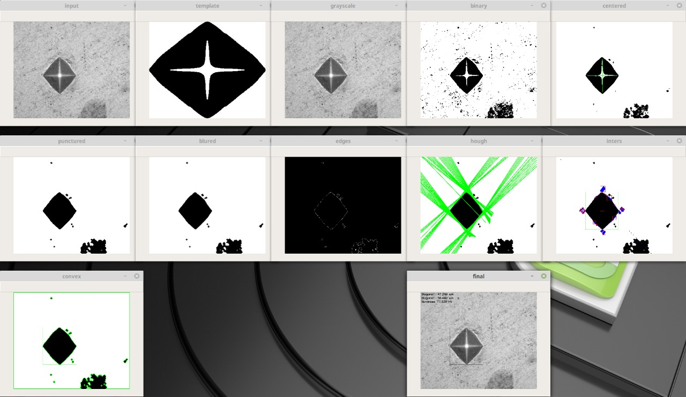

# michal-py
Digital  processing method for determining microhardness based on image data obtained 
using a microhardness tester.

**michal-py** is the application for parsing a group of pictures with images of a 
depression after pressing various materials during the Vickers test with a Qness Q10 
microhardness tester. It is developed based on Python following OpenCV library and 
provides easy-to-use API. With **michal-py**, users can quickly quickly calculate the 
hardness of the material from the image and visualize them.

---

## Installation

The installation procedures in Windows 10 Linux Ubuntu 16.04/14.04 32-bit LTS or 
Linux Mint 19.* 64-bit are shown here as examples.

---

### Dependencies

There are list of inner package dependencies:

- Python 2.7 / 3.6
- cv2
- glob
- unittest
- sys 
- yaml
- numpy

---

#### OpenCV:

The OpenCV 4.2.0 used as additional library. Install using 
[tutorial](https://pypi.org/project/opencv-python/).

---

#### PyCharm IDE:

See [PyCharm installing](https://www.jetbrains.com/ru-ru/pycharm/).

Using PycharmIDE you will install python packages rapidly. 
The IDE itself will tell you about the missing packages and offer to install them. 
There is also a built-in Markdown Editor. 

---
### Linux
```
sudo apt-get install python-numpy python-yaml python-glob python-opencv

```
or using pip:
```
sudo pip install glob2 glob3 pyyaml numpy opencv-python opencv-contrib-python
```
### Windows
Download [Python](https://www.python.org/downloads/windows/) and add Python to to PATH.<br/>

Download [OpenCV](https://www.lfd.uci.edu/~gohlke/pythonlibs/#opencv)<br/>
```
pip install -m <path-to>/opencv_python-*.*.*-*-none-win**.whl
pip install -m numpy yaml glob
```
---

## [Tests](./test_michal-py/TEST.md)

---

## Development setup

Describing how to install all development dependencies and how to run an automated 
test-suite of some kind. Potentially do this for multiple platforms.

---

### Configuration file

Located in ./cfg/config.yml.<br/>

IO parameters:<br/>

```puncture_tpl_file``` - template image postfix name (Options: ideal, original, smooth).<br/>
```gui``` - flag if need draw images (Options: True, False).<br/>
```trace``` - flag if need trace processing steps info (Options: True, False).<br/>

Preprocess parameters:<br/>

```kernel_shape``` - OpenCV kernel shape (Options: 0 for cv2.MORPH_RECT, 1 for cv2.MORPH_CROSS, 2 for cv2.MORPH_ELLIPSE).<br/>
```kernel_size``` - N-dimension kernel size (Options: 1 to min input image size).<br/>
```match_method``` - template to grayscale image match method (Options: 0 for cv2.TM_SQDIFF, 
1 for cv2.TM_SQDIFF_NORMED, 2 for cv2.TM_CCORR, 3 for cv2.TM_CCORR_NORMED, 4 for cv2.TM_CCOEFF, 
5 for cv2.TM_CCOEFF_NORMED).<br/>
```center_fill_size``` - center fill kernel size (Options: 1 to min template image size).<br/>  

Hough Transform parameters:<br/>

```probabilistic``` - flag if need probablistic Hough Transform (Options: False, True).<br/>
```hough_threshold``` - threshold of line length in ptx (Options: from 0 to ...).<br/>

Filter and sort the intersections parameters:<br/>

```groups_min_distance``` - minimal distance between sorted groups when puncture calculated (Options: 0 to ...).<br/>
```max_gab_tolerance``` - distance between puncture params calculated by Hough Transform and Convex Hull methods (Options: 0 to ...).<br/> 

Finalize parameters:

```result_compare_tolerance``` - postprocess comparison punctures.<br/>
```symmetrize_tolerance``` - postprocess comparison punctures to simmetrize.<br/>

```
cd michal-py
git checkout master
./scripts/run.sh
```

Or using PyCharm IDE:

```*Run->* 'main':```

### Steps

Detail algorithm description in articles [cz](./doc/cz.pdf), [en](./doc/en.pdf).<br/>



Windows description:<br/>

- input - input colored image.
- template - input binary template.
- grayscale - grayscaled input image.
- binary - thresholded image using Otsu method.
- centered - found blob center using match template.
- punctured - filled blob white area sections.
- blured - Gaussian blured punctured image.
- edges - calculated Canny edges.
- hough - found lines using Hough Transform.
- inters - found intersections of lines.
- convex - Convex Hull method puncture detection.
- final - the complexed puncture from two methods wirh calculated hardness.

---

## [Release History](./HISTORY.md)

---

## Contributing

1. Clone it (<ssh://git@github.com:dleliuhin/michal-py.git>)
2. Create your feature branch (`git checkout -b feature/fooBar`)
3. Commit your changes (`git add . & git commit -m "Feature. Add some fooBar."`)
4. Push to the branch (`git push origin feature/fooBar`)
5. Create a new Pull Request to `develop`

---

## Support

Reach out to me at one of the following places!

- Telegram at <a href="http://https://telegram.org" target="_blank">`@DLeliuhin`</a>
- Email at *dleliuhin@gmail.com*.

---
